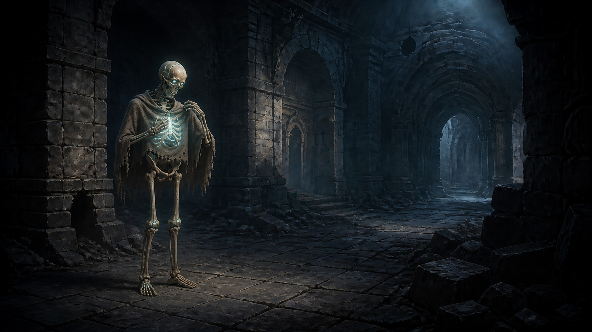
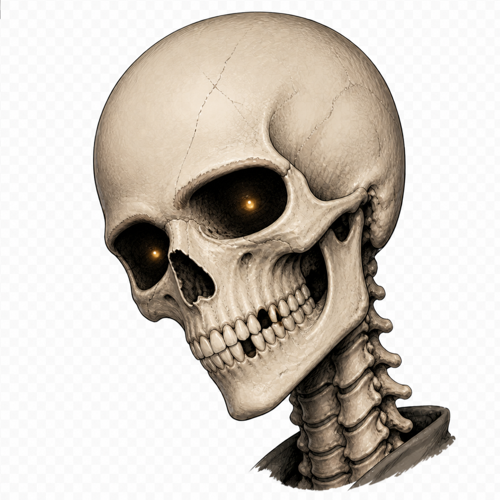

# Девлог Almsth #1: зачем скелету идти наверх

Обычно в подземелье спускаются за сокровищами, опытом и неприятностями. Мы решили начать с неприятностей: герой приходит в себя скелетом на сотом уровне и пытается добраться до поверхности.

Так появился **Almsth** — пошаговый dungeon crawler наоборот. Это небольшой инди-проект, который мы делаем вокруг идеи, в которую сами хотим играть, а не вокруг списка самых безопасных решений. В девлоге будем без больших обещаний показывать, как игра растёт: что заработало, что пришлось переделать и какие странности вылезли по дороге.

*Первый вопрос после пробуждения — не «кто я?», а «почему лестница ведёт ещё на девяносто девять этажей вверх?»*

## Сначала нужен был игровой цикл

На первом этапе мы старались ответить на довольно простой вопрос: интересно ли вообще ходить по такому подземелью?

Появился базовый цикл: исследовать этаж, находить противников и сундуки, собирать души и искать путь выше. Перемещение пошаговое — пока игрок думает, мир тоже ждёт. Но как только сделан шаг, все обитатели получают право на ответ. Это сразу сделало важными расстояние, обзор и положение в коридоре: иногда одна клетка решает больше, чем ещё один пункт урона.

Вместе с движением добавили ближний бой, первые предметы, характеристики персонажа и туман войны. Уже посещённые места остаются в памяти карты, но противники исчезают из неё, если герой больше их не видит. Нам хотелось, чтобы неизвестность была не просто чёрной шторкой, а частью принятия решений.

*Ранний прототип уже умел считать ходы, обзор и бой. Выглядел он при этом честно: как программа, которая очень старается стать игрой.*

## Процедурная генерация — это не кнопка «сделать уровень»

Этажи строятся процедурно. На бумаге всё звучит удобно: задаём размер, расставляем стены, кладём лестницу — готово. На практике генератору приходится объяснять множество вещей, которые человек считает очевидными.

Старт не должен оказаться заперт. До выхода должен существовать путь. Важные точки нельзя ставить в стену или одну на другую. Карта не должна превращаться ни в длинную кишку, ни в футбольное поле, где врага видно за три рабочих дня до встречи.

В первой версии появился большой неровный зал, точки входа и выхода, противники и сундуки. Затем генерацию пришлось много раз прогонять автоматически, проверяя связность и крайние случаи. Это та часть работы, которую почти не видно на скриншоте, зато очень хорошо видно, когда она не сделана.

Один из тестовых прогонов позже дошёл до 500 созданных этажей и 1200 случайных действий. Не гарантия вечной жизни, но уже неплохой способ убедиться, что скелет хотя бы не замурован в стене при рождении.

## Игра начала искать своё лицо

Параллельно мы перебирали внешний вид героя. Скелет удобен тем, что его силуэт понятен сразу. Неудобен он тем, что скелетов в играх уже примерно столько же, сколько деревянных ящиков.

*Один из вариантов, который остался в рабочей папке. Не всё нарисованное обязано попадать в игру — иногда оно нужно, чтобы понять, куда идти дальше.*

Мы пока не пытаемся выдать прототип за почти готовый продукт. Часть интерфейса временная, визуальный стиль ещё уточняется, а цифры наверняка изменятся. Но основа уже существует: можно создать персонажа, выйти на этаж, исследовать его, подраться, найти добычу и подняться выше.

Для первой условной недели этого достаточно. Скелет встал. Теперь надо разобраться, что он будет терять, находить и менять по пути.

## Коротко за неделю

**Сделали:** пошаговое движение и бой, процедурный этаж, туман войны, первые предметы, противников, сундуки и переход между уровнями.

**Исправили:** несколько граничных случаев генерации и размещения важных точек; добавили автоматические проверки связности этажей.

**Обнаружили:** даже корректная карта может быть скучной, если в ней нет удобных для выбора маршрутов и боя участков. Генератору мало создавать проходимые уровни — он должен создавать ситуации.

## Что дальше

Следующий этап — смерть, база, экипировка и развитие героя. Иначе подъём быстро превращается просто в длинную лестницу с крысами.

А какой тип процедурных уровней вам интереснее исследовать: более плотные комнаты и коридоры или крупные неровные пространства, где опасность можно заметить заранее? Мы читаем ответы и готовы менять решения, пока проект ещё достаточно пластичный.
