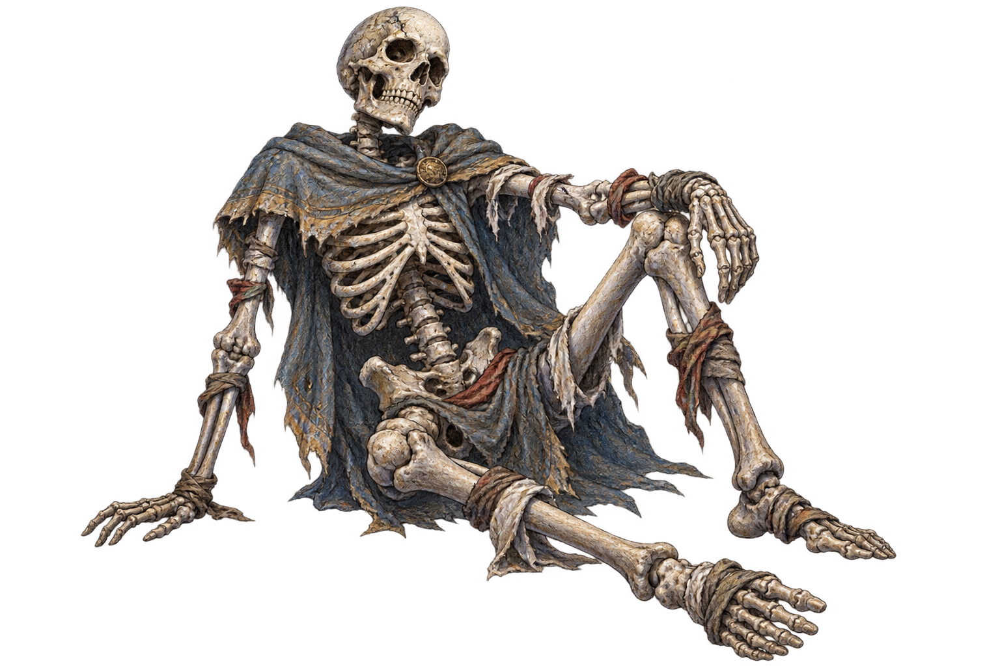

# Almsth Devlog #2: Death, the Base, and a Very Cozy Jacket

During the previous notional week, our skeleton learned to walk around a procedural dungeon and hit anything that failed to step away. This time, we worked on something less heroic but more important: consequences.

If death only means pressing Load, risk quickly becomes decorative. If the player loses absolutely everything, caution turns into frustration. We needed a middle ground in which every expedition has a price but does not erase all progress.

## Two Kinds of Souls and One Unpleasant Death

Souls are the main resource in Almsth. During an expedition, the protagonist carries them and risks losing them. Returning safely allows part of the progress to be secured at the base. This creates a clear choice: continue climbing for a greater reward, or turn back while things are still going well.

Death returns the protagonist to their initial body and removes the equipment found during the current run, while secured souls and base development remain. We want defeat to matter without deleting an entire evening along with the save file.

*The camp is where loot becomes permanent progress, and where a skeleton can briefly pretend to own property.*

## A Base Should Be Useful, Not Just a Pretty Menu

A camp appeared on floor 100. It began as a safe point between expeditions, then gained structures for dismantling unwanted items, improving weapons, and protecting especially important equipment.

We did not want the base to become a separate spreadsheet with twenty tabs. Its services exist as physical objects in the camp. Select the crusher to dismantle items. Visit the whetstone to work on weapons. The space gradually changes together with the player’s progress.

Wood, stone, and cloth were added as construction materials. Wood and stone can be found in chests, while unwanted armor can be dismantled into cloth. That gives equipment a second kind of value: even a useless breastplate might become part of the next base upgrade.

## Inventory: Where a Simple List Stops Being Simple

The game gained a card-based inventory with equipment, filters, and item comparison. It sounds like a routine task until the questions begin.

What happens to an equipped item when it is upgraded? Can a protected item be dismantled accidentally? Where does a bound item go after death? How do we explain the difference between two almost identical swords without making the player read an accounting report?

*The inventory can already filter and compare items. We are still working toward the point where it helps with decisions instead of merely proving that many items exist.*

The cloak became a separate equipment slot. It contains the “Cozy Jacket,” an item that cannot be removed and grants a small permanent bonus. Why does a skeleton need a cozy jacket? Because bare ribs are poorly suited to long expeditions. Sometimes a mechanic benefits from having a little personality.

## Body Development Without a Wall of Spoilers

One of the game’s central ideas is that the protagonist begins as a skeleton but does not have to remain one forever. Rare places in the dungeon allow the body to be changed by spending accumulated souls. A new stage changes attributes, available skills, and equipment.

We will not show the complete progression chain yet. What matters to us is that development feels like part of the journey rather than an ordinary class-selection menu. The player decides when to risk their resources, when to return to the base, and which direction to support with skills.

*An early equipment-screen image. Items should change not only numbers but also the readable appearance of the character.*

This mechanic quickly required skill trees, permanent attributes, and limitations for more developed bodies. It was the first time we seriously felt how one good idea can create five new systems and approximately eleven new ways to break a save file.

That is why the save format was versioned early. It is not the most dramatic part of development, but it lets us change the game without forcing players to restart after every update.

## This Week in Short

**Added:** the camp, carried and secured souls, death with partial progress loss, equipment, card-based inventory, materials, base workstations, and the first steps of body development.

**Fixed:** dangerous actions now require confirmation; items move correctly between inventory, equipment, upgrading, and binding.

**Discovered:** the more ways there are to preserve an item, the more clearly the game must explain what survives death. A colored frame is not enough.

## What Comes Next

Next, we want to improve how the game feels between major decisions: automatic exploration, waiting, audible threats, active abilities, and a cleaner dungeon interface.

What kind of failure cost do you prefer in games like this: losing all loot from the current expedition, or saving part of it by spending a rare resource? We are interested not only in harshness itself, but in the decisions it creates.
